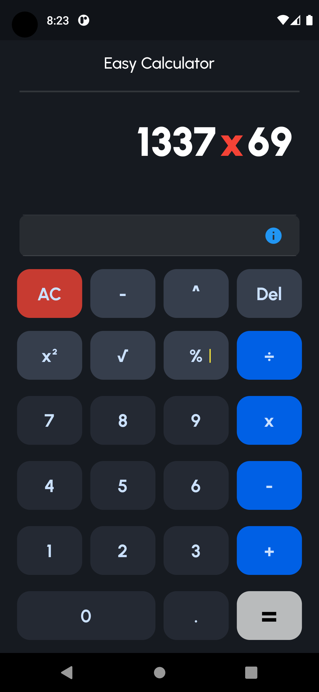
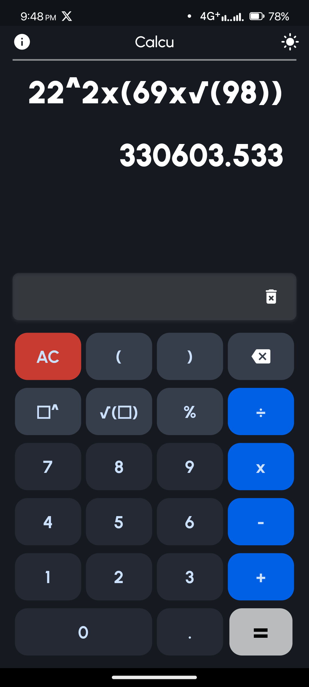
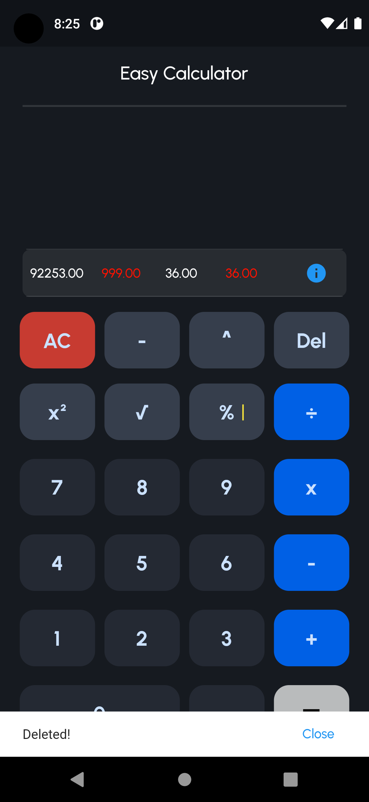
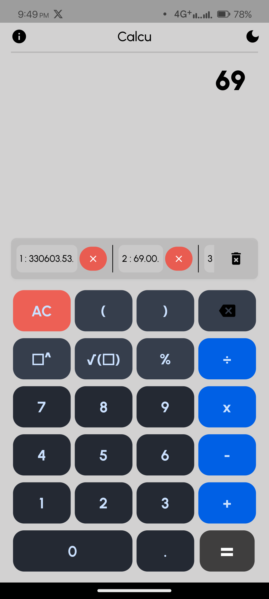
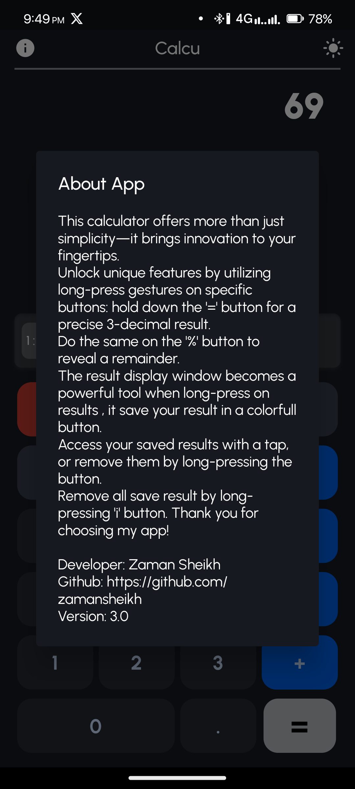

## Getting Started

# Calcu

### A Featuristic basic Calculator app for all

English
&nbsp;&nbsp;

## 📱 Screenshots

  
  
  

  
  
  

 

## 📖 Features

- This calculator offers more than just simplicity—it brings innovation to your fingertips. 

- Unlock unique features by utilizing long-press gestures on specific buttons: hold down the '=' button for a precise 3-decimal result.

- Do the same on the '%' button to reveal a remainder. 

- The result display window becomes a powerful tool when long-press on results, it saves your result in a colorful button.

- Access your saved results with a tap, or remove them by long-pressing the button. 

- Remove all save results by long-pressing the 'i' button. 

- No Ads

- Easy to use and user-friendly.

- [Material Design 3](https://m3.material.io/) style UI, with dynamic color theme.

- MAD: UI and logic written with pure Kotlin. Single activity, no fragments, only composable destinations.

## ⬇️ Download

- For most devices, it is recommended to install the **arm64-v8a** version of the apps
- Directly from Playstore: [Google Play Store](https://play.google.com/store/apps/details?id=com.decodersfamily.calcu)
- Download the latest stable version from [GitHub releases](https://github.com/zamansheikh/Calcu/releases/latest)
- Install the [pre-release](https://github.com/zamansheikh/Calcu/releases/) versions to help us test out new features & changes

## 💬 Contact

Join our [Telegram Channel](https://t.me/decodersfamily) for discussion, announcements, and releases!

## 💖 Sponsors

  -- No sponsors
  
  -- Calcu Bot will be always a free and open source for everyone. If you like it, please consider [sponsoring me](https://github.com/sponsors/zamansheikh)!

## 💲Donate 

  

## 🤝 Contributing

Contributions are welcome!

	
>**Note**

>For submitting bug reports, feature requests, questions, or any other ideas to improve, please read [CONTRIBUTING.md](https://github.com/zamansheikh/Calcu/blob/main/CONTRIBUTING.md) for instructions and guidelines first.

## 🧱 Credits

Youtube Tutorial 😁

## 📃 License

>**Warning**

>Except for the source code licensed under the GPLv3 license,
>all other parties are prohibited from using Calcu's name as a downloader app,
>and the same is true for Calcu's derivatives.
>Derivatives include but are not limited to forks and unofficial builds.

<table><td>
<a href="#start-of-content">👆 Scroll to top</a>
</td></table>

